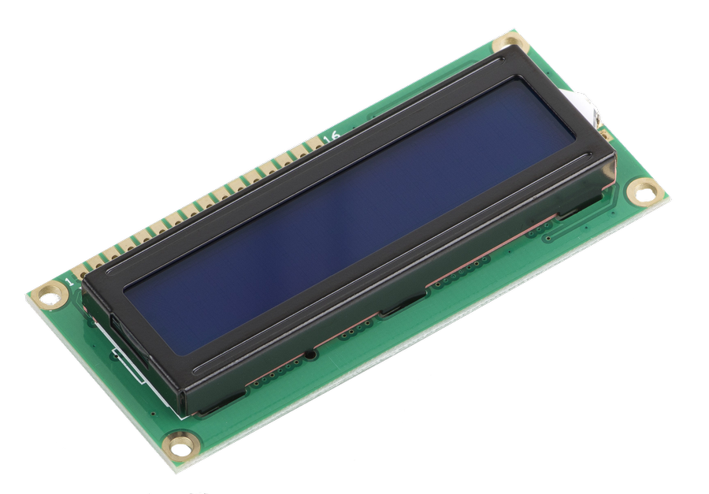

# Requirements

This document outlines the hardware *and* functional requirements for the **Smart Time Registration Device**. The system is based on an ESP32-S3-DevKitC-1-N8R8 and is designed to handle RFID-based user identification, API communication, provide user interaction through buttons to cycle between actions, LEDs, and a buzzer.

---

## Hardware Components

- **Microcontroller**: ESP32-S3-DevKitC-1-N8R8
<br> 

- **RFID Sensor**: RFID-RC522 for scanning HVA IDs
<br> 

- **LCD Display**: 16x2 LCD with I2C Backpack
<br> 

- **Buzzer**: For feedback on card scan
- **LEDs**: Multiple for system status indication
- **Buttons**: For switching between actions (e.g., Clock In, Clock Out, Start Break, End Break)
- **Connectivity**: Wi-Fi for making API calls to the website
---

## Functional Requirements

### 1. **RFID Scanning**
   - The system will use the RFID-RC522 RFID sensor to scan user HVA IDs.
   - Upon scanning, the system will push the ID data via an API call.

### 2. **API Communication**
   - The ESP32-S3 will connect to the internet to make API calls:
     - **Send scanned data** (RFID) to the server.
     - **Receive user data** (e.g., user name) in response and display on the LCD.

### 3. **Display and Feedback**
   - The LCD screen, connected via I2C, will show user information and action statuses.
   - The buzzer will sound when a card is successfully scanned.
   - LEDs will provide status indications for:
     - Power (system turned on)
     - Internet connectivity (connected/disconnected)
     - Card scan status (success/failure)

### 4. **User Input and Actions**
   - The system will have buttons to switch between different actions:
     - Clock In
     - Clock Out
     - Start Break
     - End Break

---

## Inputs and Outputs

| **Component**      | **Type**  | **Function**                                                                  |
|--------------------|-----------|-------------------------------------------------------------------------------|
| **ESP32-S3-DevKitC-1-N8R8**       | MCU       | Microcontroller to handle processing and communication.                       |
| **RC522**          | Input     | Reads RFID cards to identify users.                                           |
| **LCD Display**    | Output    | Displays the user name and system statuses.                                   |
| **Buzzer**         | Output    | Emits sound on successful card scan.                                          |
| **LEDs**           | Output    | Shows system status: Power, Internet Connectivity, and Card Scan result.      |
| **Buttons**        | Input     | Allows the user to switch between actions (Clock In, Clock Out, etc.).        |

---

## System Workflow

1. **Power On**: System starts, LEDs indicate power and system status.
2. **Internet Connection**: LED indicates when the system is connected to the internet.
3. **RFID Scan**: User scans their ID card using the RC522 sensor.
4. **API Call**: The ESP32-S3 sends the RFID data to the server via API.
5. **API Response**: System receives user information and displays it on the LCD screen.
6. **Action Selection**: User selects the action (Clock In/Out, Start/End Break) via buttons.
7. **Feedback**: Buzzer sounds when a card is scanned, LEDs change based on status (e.g., card scan success).

---

## DLO Requirements

| **Requirement ID#** | **Requirement**                                                                                                                                                      | **MoSCoW** | **Compliant** |
|---------------------|----------------------------------------------------------------------------------------------------------------------------------------------------------------------|------------|---------------|
| **EMBRQ#01**        | The embedded device acts as a client and sends measured sensor data to the application backend over HTTP or HTTPS.                                                     | MUST       | YES            |
| **EMBRQ#02**        | The embedded device also acts as a server and receives status messages from the application backend over HTTP or HTTPS.                                                | MUST       | YES            |
| **EMBRQ#03**        | The embedded device contains at least two types of input sensors (e.g. LDR, buttons, joystick, capacitive touch, etc.).                                                | MUST       | YES            |
| **EMBRQ#04**        | The embedded device contains at least two types of visual and/or sensory outputs (e.g. LED, LED Matrix, 7-segment display, motor, servo, actuator, LCD-screen, buzzer, etc.). | MUST       | YES            |
| **EMBRQ#05**        | The embedded device uses the WifiManager for configuration of SSID and password (PWD) for connecting to the network.                                                   | MUST       | YES            |

---

### EMBRQ#01

**Requirement**: The embedded device acts as a client and sends measured sensor data to the application backend over HTTP or HTTPS.

**Explanation**:  
The code uses the `HTTPClient` library to send data to the backend API. This is implemented through a function that collects temperature and humidity data from the DHT sensor and then sends it using an HTTP POST request to the server.

**Code**:
```cpp
#include <HTTPClient.h>
#include <DHT.h>

#define TEMP_SENSOR 26 // Analog Pin
#define DHTTYPE DHT11  // DHT 11 type sensor

DHT dht(TEMP_SENSOR, DHTTYPE);

void sendSensorData() {
    HTTPClient http;
    String serverPath = "http://your-server.com/api.php";
    
    // Read temperature and humidity
    float temperature = dht.readTemperature();
    float humidity = dht.readHumidity();

    // Start connection and send HTTP header
    http.begin(serverPath);
    http.addHeader("Content-Type", "application/json");
    
    // Create JSON payload
    String jsonPayload = "{"temperature": " + String(temperature) + ", "humidity": " + String(humidity) + "}";
    int httpResponseCode = http.POST(jsonPayload);
    
    // End connection
    http.end();
}
```

---

### EMBRQ#02

**Requirement**: The embedded device also acts as a server and receives status messages from the application backend over HTTP or HTTPS.

**Explanation**:  
The code uses the `ESPAsyncWebServer` library to create an HTTP server on the ESP32. The server can receive status messages from the backend, which are processed by specific request handlers.

**Code**:
```cpp
#include <ESPAsyncWebServer.h>

AsyncWebServer server(80);

void setup() {
    // Start server
    server.on("/status", HTTP_POST, [](AsyncWebServerRequest *request) {
        String message;
        if (request->hasParam("status", true)) {
            message = request->getParam("status", true)->value();
            // Handle status update
        }
        request->send(200, "text/plain", "Status received");
    });
    server.begin();
}
```

---

### EMBRQ#03

**Requirement**: The embedded device contains at least two types of input sensors (e.g. LDR, buttons, joystick, capacitive touch, etc.).

**Explanation**:  
The embedded device uses both an RFID sensor (`MFRC522`) and a DHT11 sensor as input devices. The RFID sensor is used to read card data, while the DHT11 sensor measures temperature and humidity.

**Code**:
```cpp
#include <MFRC522.h>
#include <DHT.h>

#define SS_PIN 5    // SDA/SS Pin for SPI
#define RST_PIN 17  // Reset Pin for SPI
#define TEMP_SENSOR 26 // Analog Pin
#define DHTTYPE DHT11  // DHT 11 type sensor

MFRC522 mfrc522(SS_PIN, RST_PIN);
DHT dht(TEMP_SENSOR, DHTTYPE);

void setup() {
    SPI.begin();
    mfrc522.PCD_Init();
    dht.begin();
}
```

---

### EMBRQ#04

**Requirement**: The embedded device contains at least two types of visual and/or sensory outputs (e.g. LED, LED Matrix, 7-segment display, motor, servo, actuator, LCD-screen, buzzer, etc.).

**Explanation**:  
The embedded device uses an LCD display (`LiquidCrystal_I2C`) to show status messages and a buzzer for auditory feedback. The LCD provides visual output, while the buzzer is used for alerts or notifications.

**Code**:
```cpp
#include <LiquidCrystal_I2C.h>

#define BUZZER_PIN 25 // Buzzer Pin

LiquidCrystal_I2C lcd(0x27, 16, 2);

void setup() {
    lcd.init();
    lcd.backlight();
    pinMode(BUZZER_PIN, OUTPUT);
    
    // Example usage
    lcd.setCursor(0, 0);
    lcd.print("Welcome!");
    digitalWrite(BUZZER_PIN, HIGH); // Sound the buzzer
    delay(500);
    digitalWrite(BUZZER_PIN, LOW);
}
```

---

### EMBRQ#05

**Requirement**: The embedded device uses the WifiManager for configuration of SSID and password (PWD) for connecting to the network.

**Explanation**:  
The `WiFiManager` library is used to manage the Wi-Fi connection. If no known SSID is found, the device will start an access point, allowing the user to configure the Wi-Fi credentials via a web interface.

**Code**:
```cpp
#include <WiFiManager.h>

void setup() {
    WiFiManager wifiManager;
    // Automatically connect using saved credentials, or start AP for configuration
    wifiManager.autoConnect("BeertrackerAP");
}
```

---