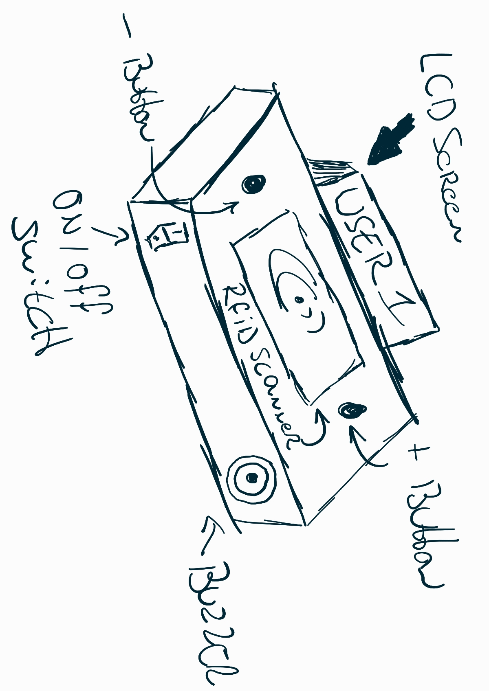

# Smart Time Registration

## What is a Time Registration Device?
The Smart Time Registration device is a tool used to track the ammount of time an employee has spent working, it can take on many forms. Traditionally, this was a a physical time clock where employees would 'punch in and out' their card, recording their hours manually.

Nowadays, time registration devices are often available as websites or mobile apps. These tools can not only track overall work hours but also allow users to log time spent on specific tasks or projects. This tracking is then used for billing purposes, project management, and ensuring accurate payroll processing.

## The vision
TODO: work on this
I want the device to work like this and look something like this and work this way etc etc

## Project Requirements

(image will be changed  when better sketches are available)

### Embedded Device
For this project, the ESP32, along with other devices, will serve as the core component of the embedded product. Various sensors and peripherals, including an RFID scanner for scanning students' HVA IDs, buttons, and displays for data visualization, will be connected to the ESP32.

#### The 3 minimum requirement for Input & Ouput are:
**INPUT:**

1. RFID Scanner

2. Buttons for increment and decrement (plus & minus)

3. On / Off Switch

**Output:**

1. LED Indicators

2. LCD Screen

3. Passive Buzzer

### Website

The website will implement user registration using HVA IDs and passwords. Users will be listed with their clock-in and clock-out times for the day. Further developments and applications of this data are to be determined.

### User Experience Design (CAD)

The device will be housed in a compact enclosure designed using CAD, with the software OnShape.

---

## Market Research
Once the blueprint requirements are met, the device will be changed adding our own flavor and features. For example, a counter registration system will be integrated to track beverages, which will be added to a user database when they scan their pass. The device will also be integrated into a already running project "BeerTracker". 

## What is BeerTracker?

BeerTracker is a website designed, made and managed by Lars Grit for his class at the University of Applied Science of Amsterdam to keep a track of how many beers have been bought and drank to avoid the classic tradition of "tikkies". Using the BeerTracker the class is made aware of how much people are chipping in to keep the drinks even.

During the implementation of this device the website will be heavily changed and updated.

---

## Project Plan

Throughout the duration of the project, I will be working on various aspects in parallel, rather than focusing on just one area each week. However, by the end of each week, I aim to have completed the specific tasks and milestones outlined for that week.

### **Week 1: Initial Setup**
- Set up the fundamental components of the project, including hardware like the ESP32, RFID sensors, etc and environment, and software like setting up platformIO, Docker, and python for the Portfolio Website.

### **Week 2: Network and Website Integration**
- Connect the esp32 to the network and work on data communication.
- Setup REST-API
- Develop a basic website that interfaces with the clock-in and clock-out system, getting data from the database.

### **Week 3: CAD Housing Design**
- Design and create a CAD model for the housing of the device to ensure everything fits well within the enclosure.

### **Week 4: Blueprint Finalization**
- Finalize the overall project blueprint, including diagrams, wiring, and database structure.

### **Week 5: Market Research and Beer Tracker Integration**
- Conduct market research to assess project feasibility and potential features.
- Explore integration with beertracker.

### **Week 6: User Experience Design & Branding**
- Expand on the User Experience Design, focusing on improving usability and user interface.
- Start adding branding elements, making the project aesthetically appealing.

### **Week 7: Web Development**
- Focus on refining the web interface, enhancing functionality, and integrating with beertracker.nl.

### **Week 8: Additional Features (Alcohol Sensor)**
- Add nice-to-have features like an alcohol sensor to track usage and safety.
- Work on UED, web enhancements, and embedded system improvements for this new feature.

### **Week 9: Final Feedback**
- Gather and implement feedback from peers, teachers, and potential users to fine-tune the system.

### **Week 10: Project Finalization**
- Finalize the project, ensuring all features are tested, the device is functioning as intended, everything is documented, `and everything is ready for production.

--- 

## Use of AI
The use of AI has been used writing this project to improve readability with better grammar 

{{ mdocotion_header('https://cdn.prod.website-files.com/65730eadde5e46a394ae1451/65730eadde5e46a394ae14ca_ES%20-%20Image%20home%202.jpg') }}