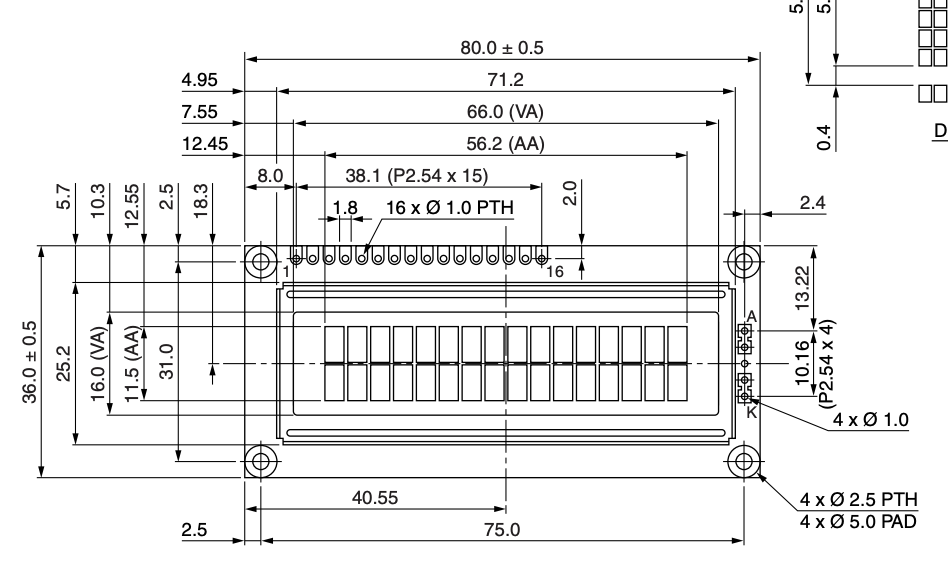

# Learning journal

## Week 1
In week one I tried to tackle a bunch of different aspects of the project. I choose the blueprint **Smart Time Registration.** and started planning out what I needed to create for this project. I have been keeping track of my tasks and ideas in Trello. 

I setup the project using Docker, created a venv for python so I could run my portfolio website locally and started working on the *Embedded* part of the project first.

I started creating my circuit in Fritzing and using the WeMOS which I later switched over to the ESP32-S3 after seeing that for the additional sensors and outputs I wanted to add still I would not have the available pins required on the WeMOS so I moved over to the ESP32.

I then built the circuit on my breadboard and wrote the code for it, and I was able to read the UID of the HvA passes.

I then moved my focus to writing the required documentation for the work I've done and shifted my focus on two other aspects of the project. The website and the User Experience Design. For the website I wanted to start with looking into how to make the database required for project and started making an ERD. This ERD still has to be worked on further and implemented. For User Experience Design I wanted to start learning how to use CAD and how to adapt CAD Designs to existing components.

I took an LCD to start learning this, I looked up the datasheet where I was able to find the dimensions of the device and started sketching that out in OnShape where I could then design an enclosement around it.

### Feedback
**🧰 System Requirements** (solved)

**Reviewer:** Koen Lammers

**Feedback:** It looks like a realy good page for your system requirement, realy detailed and covers all the parts of your system. Be sure to check them to yes when you finish one and also add the description with code on how you solved the problem!

**Takeaway:** I should often revisit this page and see whether I've finished a requirement and properly document it when I do.

 

## Week 2
Lorem ipsum dolor sit amet, consectetur adipiscing elit. Proin non maximus lectus. In eleifend nibh nibh. Morbi erat justo, suscipit non rutrum a, venenatis auctor metus. Vestibulum vitae tellus eget purus commodo congue. Maecenas id nunc at mauris dictum ornare ac eget libero. In tincidunt condimentum arcu. Aenean condimentum auctor faucibus. Nullam id euismod justo, id laoreet magna. Sed urna ipsum, dignissim in nulla ac, dictum pulvinar felis. Nam eget molestie arcu.

### Feedback
**🧰 Technical Documentations** (unsolved)

**Reviewer:** Melvin Moes

**Feedback:** Looks good maybe add the prices to the component list. This way you could show a total price of making your system

**Takeaway:** I should add a column with prices, even though Melvin did not mention it I should change the BOM to places where I can purchase one from instead of where I got it. I should remove the HvA as supplier for example.

 

**🌐 Database** (unsolved)

**Reviewer:** Melvin Moes

**Feedback:** Looks good except for some information is redundant. The datatypes should be excluded and the identifier should be underlined. (ERD)

**Takeaway:** I should change the ERD and remove datatypes and underline identifiers, these steps should be implemented in the EER instead only.