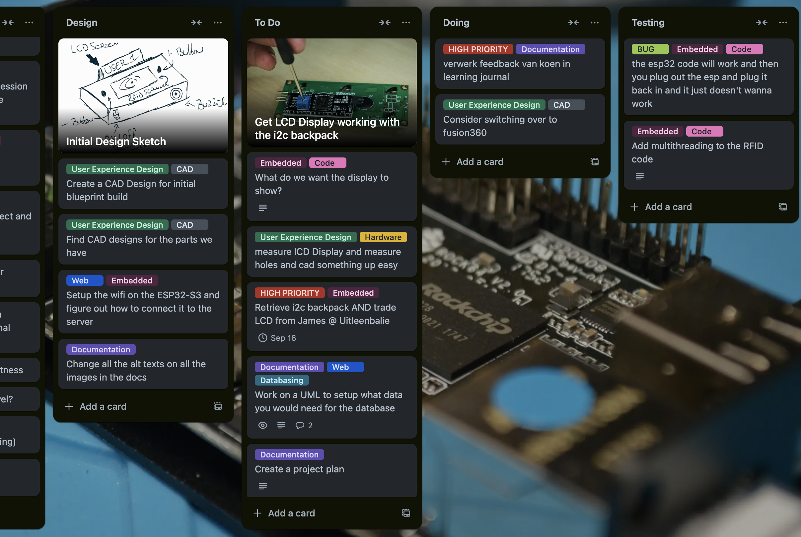
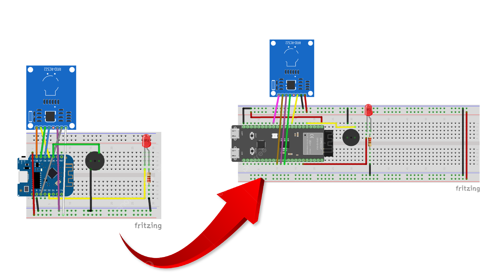
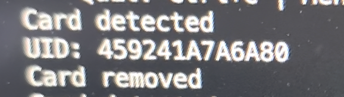
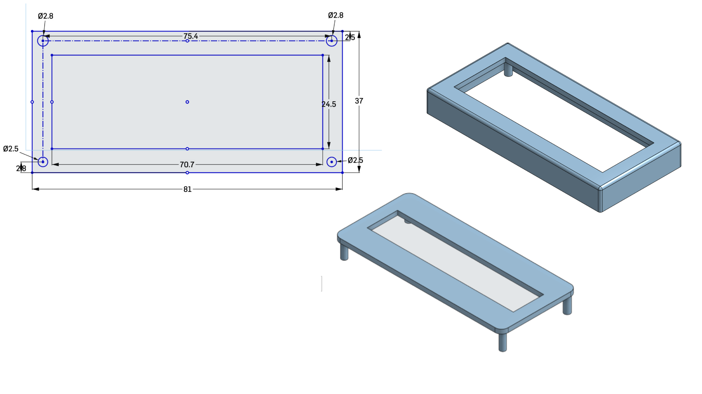

# Learning journal

## Week 1
In week one I tried to tackle a bunch of different aspects of the project. I choose the blueprint **Smart Time Registration.** and started planning out what I needed to create for this project. I have been keeping track of my tasks and ideas in Trello. 

I setup the project using Docker, created a venv for python so I could run my portfolio website locally and started working on the *Embedded* part of the project first.

I started creating my circuit in Fritzing and using the WeMOS which I later switched over to the ESP32-S3 after seeing that for the additional sensors and outputs I wanted to add still I would not have the available pins required on the WeMOS so I moved over to the ESP32.

I then built the circuit on my breadboard and wrote the code for it, and I was able to read the UID of the HvA passes.

I then moved my focus to writing the required documentation for the work I've done and shifted my focus on two other aspects of the project. The website and the User Experience Design. For the website I wanted to start with looking into how to make the database required for project and started making an ERD. This ERD still has to be worked on further and implemented. For User Experience Design I wanted to start learning how to use CAD and how to adapt CAD Designs to existing components.

I took an LCD to start learning this, I looked up the datasheet where I was able to find the dimensions of the device and started sketching that out in OnShape where I could then design an enclosement around it.

 

### Feedback
**🧰 System Requirements** (solved)

**Reviewer:** Koen Lammers

**Feedback:** It looks like a realy good page for your system requirement, realy detailed and covers all the parts of your system. Be sure to check them to yes when you finish one and also add the description with code on how you solved the problem!

**Takeaway:** I should often revisit this page and see whether I've finished a requirement and properly document it when I do.

 

## Performance Review Week 1

 

---

## Week 2
Week two started with writing out my learning journal and figuring out how to tackle the feedback and also writing out a project plan with weekly goals and aspirations. This week was a lot of work building the website and making the required steps to achieve it. I started with the database where I used UML to figure out what data was required of this project to be in a database and sketched out an ERD. When that looked good I started making the EERD in *MySQL Database* from which I could generate my database.

With the database up and running it was time to start working on the website, this had to be done with the PHP, JS and HTML + CSS for styling. Using PHP I could make query's and calls to my database and encode it withing JSON which JS can fetch and work out it's information with it. I created a connection check that checks if the website has connection to the database and created a table which prints out all the users and their associated pass UID. 

To secure the website and database I didn't want to have my credentials hard coded into the websites code so I had to learn how to expand my docker to install composer from which I could then install php packages like DOTENV which made it possible for me to store my database credentials in an only local file so other people could not have access to it.

Having created a solid basis for the website I expanded my embedded part by adding a new output, the lcd screen. Getting it to work was a lot of trial and error. I used the i2c backpack which I had to solder unto the lcd screen itself. Using this I significantly lowered the amount of pins required to get the LCD display to work. My biggest struggle was to get the lcd display sufficiently powered since it requires 5v and the esp32 only has 3.3v output pins. This required me to use the 9v battery included in the IoT kit but not wanting to overpower the display I had to come to a solution to get the power from 9v to 5v for which I used a mini DCDC converter which gave me an output of 5v. 

Lastly I have gotten my esp32 connected to the wifi using a wifi manager which makes it so I again don't have any potential important info saved in the code. I sketched out some more designs for my device and thought of fun additions and created the basis for my API. Which will handle the data calls from device to device.

 

### Feedback
**🧰 Technical Documentations** (unsolved)

**Reviewer:** Melvin Moes

**Feedback:** Looks good maybe add the prices to the component list. This way you could show a total price of making your system.

**Takeaway:** I should add a column with prices, even though Melvin did not mention it I should change the BOM to places where I can purchase one from instead of where I got it. I should remove the HvA as supplier for example.

 

**🧰 Technical Documentations** (unsolved)

**Reviewer:** Koen Lammers

**Feedback:** Be sure to add the url to the store pages! the rest looks clean and good!

**Takeaway:** I should make sure to add links to the suppliers in the BOM to redirect them to the product.

 

**🌐 Database** (unsolved)

**Reviewer:** Melvin Moes

**Feedback:** Looks good except for some information is redundant. The datatypes should be excluded and the identifier should be underlined. (ERD)

**Takeaway:** I should change the ERD and remove datatypes and underline identifiers, these steps should be implemented in the EER instead only.

 

**🌐 Technical Documentation** (unsolved)

**Reviewer:** Nick Schokker

**Feedback:** I like the structure of your technical documentation but i would say you can improve if you give a few visual example so its better to understand with the text

**Takeaway:**  I should add short and concise code snippet to the technical doc aswell to make it more readable.

 

## Performance Review Week 2

 

---

## Week 3

Week 3 started with User Experience Design, by following a laser cutting workshop of Joey. Here I learnt how to use a lasercutting machine and what to look out for. Following this workshop I wanted to do more research in 2d and 3d cadding and followed a tutorial on 2d CADding which I could apply to laser cutting.

I then worked on embedded and getting it connected to the web, last week I got the esp32 connected to the wifi but now I had to figure out how to get it to send actual data. In php I started setting up the rest API to collect data from the esp32. and on the esp32 I had to figure out how to use post requests to send the data to my website through the API. Next step would be to collect data from the site to the esp32 for displaying user name on the LCD for example.

For the embedded parts I had to figure out how to use capacitors and use it with the DCDC mini converter to get nice stable voltage flowing through the device and convert that batteries 9v to 5v for both powering the esp32 itself but also the DHT11 and LCD. I also added a DHT11 sensor that every so often updates the system by sending internal temperatures and humidity. Multiple LEDS for status showing power, wifi connection and card scanned and buttons for selecting modes.

Along with updating the proper documentation for it and debugging the embedded hardware and software took two days time aswell.

 

### Feedback
**👩‍🎨 Concept & Design** (solved)

**Reviewer:** Lucas Hilgevoord 

**Feedback:** I would brothen [broaden] your userbase a bit, so not only 3rd year students, but all the students of HvA. Looks good for the rest!

**Takeaway:** I should change my userbase and scope to make the project available for all hva studenten since they will all have the hva ID's required to make the project.

 

**👩‍🎨 Concept & Design** (unsolved)

**Reviewer:**  Simon Sweerz

**Feedback:** Ik denk dat het idee van SMART requirements is dat je meerdere requirements hebt, die allemaal SMART geformuleerd zijn. Voor de rest leg je goed uit voor wie beertracker is en waarvoor het is bedoelt.

**Takeaway:** Ik moet meerdere smart doelen maken.

 

## Performance Review Week 3

Sadly this week I got below average, due to much time spent on learning CAD and working on and debugging hardware I did not have enough commits. Combined with being sick and not attending school on the friday.

 

---

## Week 4
The week started with writing a lot of documentation, I was lacking behind especially with Concept & Design (the feedback counted for week 3). The rest of week was primarily working on my api and embedded to get two communication working. This was a longer than anticipated task seeing how my esp32 also died during it and I didn't know for a whole day trying to debug. But I managed to create a two way communication where the esp32 sends the card UID and it receives the user's name associated with that UID, back from the api to display it on the LCD.

 

### Feedback
**👩‍🎨 Concept & Design** (unsolved)

**Reviewer:** Koen Lammers

**Feedback:** Hi Lars, please take into account that pla has a low glass transition point. this means that when your device is on a table on a sunny day, it might get soft or melt. for the summer it would be better to use a material like PETG, which has a higher glass transition temperature.

**Takeaway:** For prototyping I can use PLA but for the end product it should be better to use PETG to ensure the encasing doesnt melt or get soft.

 

## Performance Review Week 4

Sadly again, another week of below expectations. I put in the hours but due to a lot of debugging hardware this weekend with non functional esp32's and sickness lowering my productivity I'm not there 100% and it shows on the performance review.

 

---

## Week 5

This week I did a lot of work implementing the api and back-end logic for the clock in clock out system, in the form of sessions. Sessions are day(s) bound where users can check in and check out using the rfid scanner (tested using Postman to make post requests). Their timestamps are recorded and a total is adjusted. On the embedded side there has been a lot of research and rebuilding. To begin my esp32-s3 has been replaced by a esp32-32 after showing faulty activity, the reason why I picked the esp32-32 was due to the fact of the 5v output which resulted in not needing to use the 9v battery and the dcdc converter resulting in a simpler hardware setup.

With this implemented I was closing in on finishing my blueprint on the code and hardware side. However my RFID scanner is very inconsistent in it working, which lead to more research and replacing my rfid rc522 with a PN532 due to it's ability to work with i2c. The i2c protocol is already being used in the project for the LCD and works well, while the ISP connection of the old rfid scanner is very inconsistent.

Last thing to be implemented was a heartbeat wifi connection to see if the esp32 is connected with the wifi and able to see it on the websites. The esp32 send an occasional heartbeat to the database with a healthy connection status and a timestamp. and on the website they look at the time stamp and see if it is in the websites frequency of (30 seconds).s

 

### Feedback

 

**🌐 API Reference** (solved)

**Reviewer:** Lucas Hilgevoord

**Feedback:** Looks good! Nicely formatted :D

**Takeaway:** N/A

 

## Performance Review Week 5

 

---

## Week 6

This week I was sick and absent.

 

## Performance Review Week 6

 

---

## Week 7

After healing from my sickness I started developing with the PN532 RFID sensor and making it work with i2c. I had to learn how to handle multiple i2c devices by using their specific i2c addresses. A lot of time was spent working on and debugging the code of the PN532 on multiple platforms to get a solid and consistent scanning workflow. 

The rest of the week was spent fully on UED with using CAD to create a physical housing for the device. I went through 15~ versions of the current design before landing on something that I was happy with and that worked and that I could use forward. It was not only a process of creating a design but also learning CAD itself and learning new techniques to further my project design. This also required a lot of trial and error getting parts to fit well and be placed well to keep enough space for every part.

 

*Multiple CAD design iterations*

 

*Printed physical product*

 

### Feedback

 

**🌐 👩‍🎨 Concept & Design** (unsolved)

**Reviewer:** Nick Schokkers

**Feedback:** Looks good to me

**Takeaway:** Helpful...

 

## Performance Review Week 7

glu
 

Made great progress today and the performance review looks good, sadly I didn't request enough feedback

---

## Week 8

Week 8 begun with looking into my research for my project, I have two main subjects I'm working on further development with PCB design and Accesibility in UX, specifically the less fortunate in sight. In addition to exploring PCB design and accessibility, I investigating how humans react to specific sounds, which can be useful for implementing a buzzer in my project to deliver positive or negative feedback through different tones. Furthermore, I'm considering how Braille could be incorporated to enhance accessibility, alongside potential voice activation features that would allow users to interact with the device hands-free and without needing sight. This combination could significantly improve usability for visually impaired individuals. To test my product on accesibility aswell I started making up user tests for people to test my design and find edge cases and issue's people could have with the workflow of my device.

I worked on implementing the buttons to work smoothly in my embedded code by giving a small enough delay for allowing people to hold down the button to cycle and using LCD visual and buzzer audible feedback on changing options. 

This week also included a massive website front-end overhaul using bootstrap, creating multiple tabs to divide the website and having a place for a dashboard to show fun and necessary information.

This week also involved significant CAD work, focusing on creating a custom bracket for the LCD that securely latches onto the main device. It was a challenging task to design a bracket that worked seamlessly within the device’s size constraints, requiring careful adjustments to ensure both stability and functionality.

For the main device, I experimented with a fun drink-pattern design. I started by sketching and extruding patterns in alternating directions, then mirrored them for symmetry. Using Boolean tools, I refined the pattern by selectively intersecting and subtracting parts to create a cohesive, layered effect that mimics a bubbly drink texture.

Creating the drink pattern turned out to be quite a challenge, largely due to the main device's rounded corners. Since the fillets were made as sketch fillets, working around them required careful alignment and extra precision to get the pattern to flow seamlessly across the curved edges. Integrating each layer without disrupting the filleted corners added a lot of complexity, but with iterative adjustments, I managed to achieve a cohesive design that maintained the bubbly, drink-like aesthetic.

 

### Feedback

 

**🌐 👩‍🎨 Concept & Design** (unsolved)

**Reviewer:** Koen Lammers

**Feedback:** 

**Takeaway:** 

 

## Performance Review Week 8

 

## Week 9

Week 9 begun with

 

### Feedback

 

## Performance Review Week 9

 

## Week 10

Week 10 begun with

 