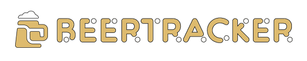
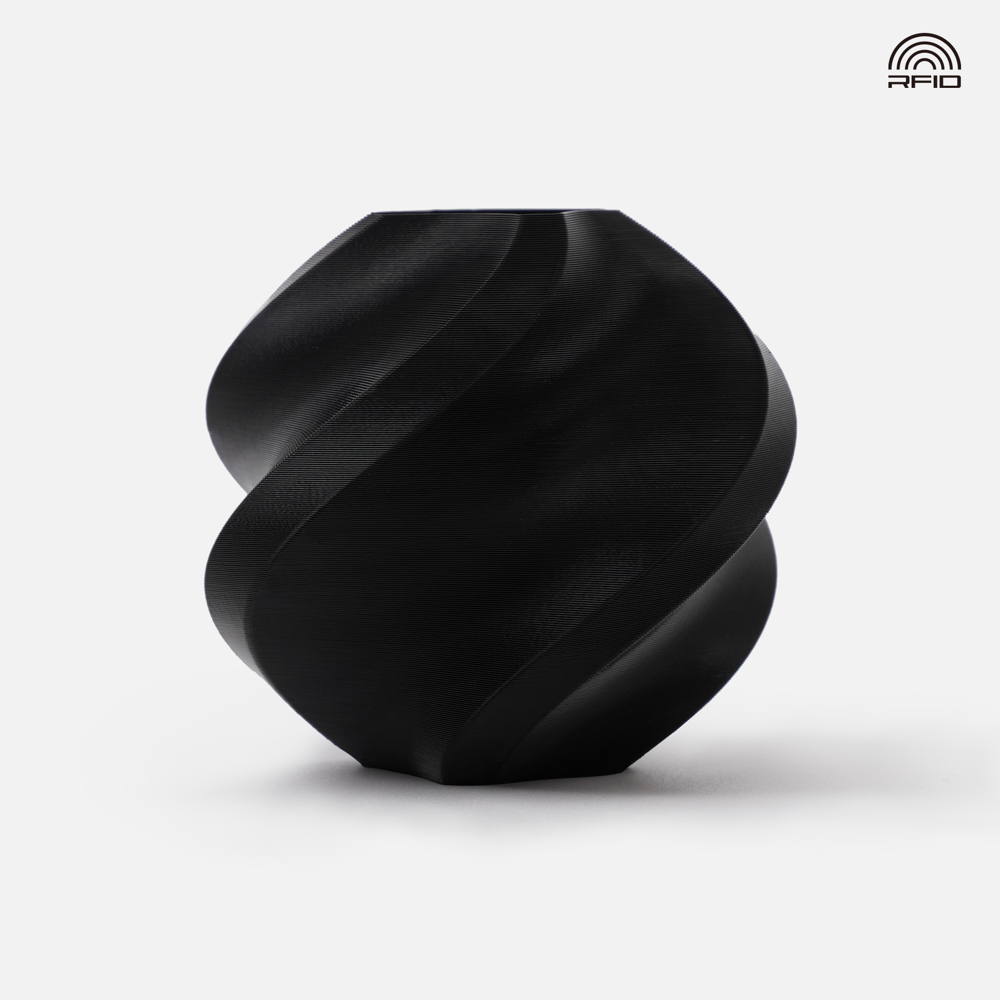
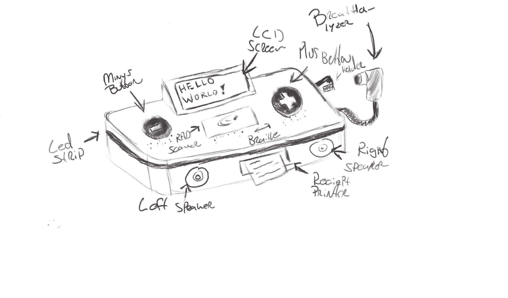

# Concept & Design

## Concept

The **Smart Check in / out system** is being developed for [beertracker.nl](http://beertracker.nl) , a platform used by students of the Amsterdam University of Applied Sciences (HvA). The system helps track beer ordering so that everyone pays equally without needing to request payments after the fact.

### Main Goal

As an HvA student using beertracker.nl, my primary goal is to ensure that the consumption and ordering of beer is tracked accurately so I can pay my fair share without having to manually calculate or request payments from others. I want a simple and efficient way to clock in when I start drinking and clock out when I'm done, knowing that the system will automatically track how much I've ordered and what I owe, ensuring fair and equal payments among all participants.

### Product Requirements

The clock in and clock out system for beertracker.nl will meet the following SMART requirements:

**Specific**:

- The system must enable users (HvA students) to clock in when they start drinking and clock out when they finish.
- It must track each user's drinking session, log the start and end times, and calculate the total beer ordering for each user.

**Measurable**:

- The system must record at least 95% of drinking sessions without error and provide clear consumption and payment data for each user.
- It will display the total number of users who have clocked in, total consumption per session, and individual ordering per user.
- The system will update the main dashboard and provide a history of each session.

**Achievable**:

- The system will use RFID tags to allow users to clock in and out quickly, minimizing manual input.
- It will integrate with the existing beertracker.nl website to synchronize consumption data in real-time.

**Relevant**:

- The system directly addresses the students' need for a fair, automated way to track beer consumption.
- It reduces the complexity of keeping track of who owes what, ensuring a hassle-free experience for social drinking events.

**Time-bound**:

- The system will be fully implemented and tested by the end of the 10-week project period.

### Users

The primary users of this system are HvA students in their third year. They need a system that can accurately track the order of beer in a fair and automated way, ensuring that payments are distributed equally among all users.

#### Scope

- The system will only be used by HvA students in their (current) third year.
- The scope includes beer (pitcher) order tracking, clocking in and out of sessions, and easy access to consumption data.

### User Needs

#### SMART Goals

- **Specific**: The system must allow students to clock in when they start drinking and clock out when they stop, accurately logging consumption times and calculating how much each person owes.
- **Measurable**: The system should record the number of users and total beer consumption during each session.
- **Achievable**: The solution will be implemented using RFID scanning of HvA IDs to make clocking in and out simple and quick.
- **Relevant**: This system directly addresses the problem of unequal beer consumption and payment confusion among students.
- **Time-bound**: The system should be operational by the end of the 10-week project period.

 

## Digital Manufacturing & Material

For the **Smart Check in / out system** encasing, I will be 3D printing the housing using **PLA (Polylactic Acid)** on my personal **Bambu Labs A1 Mini** due to its ideal properties for this type of project.

### Material Properties

- **Strength**: PLA provides fine structural integrity for a device that won't be used in high-impact environments. It will also be mobile and not have to weather the elements. However, if more structural strength is required, I have the option to use **carbon-infused filament**, which offers enhanced durability and stiffness.

- **Ease of Use**: PLA is easy to print and works well with the Bambu Labs A1 Mini, making it perfect for quickly prototyping and iterating the design. It is odorless, inexpensive, and readily available.

- **Precision**: With the A1 Mini, the design details such as RFID scanner cutouts, button placements, and ventilation for sensors will be aligned with high accuracy, ensuring a perfect fit.

- **Environmental Consideration**: PLA is eco-friendly, being derived from renewable resources and can be reformed into more spools.

- **Speed of Production**: The Bambu Labs A1 Mini is a fast and reliable printer, allowing me to quickly produce and test multiple versions of the enclosure.

 

## Design Sketches

## Digital Design

For the digital design of the encasing, I am using **Onshape**, a cloud-based CAD platform. Onshape provides several advantages for this project:

- **Browser-Based Access**: Since Onshape runs entirely in a web browser, I can access and modify my designs from any device with an internet connection, eliminating the need for specialized hardware or software installations.
- **Ease of Use**: Its intuitive interface and powerful set of tools make creating complex 3D models straightforward, ensuring the encasing design fits all internal components accurately.
- **Version Control**: Onshape tracks every change made to the design, allowing me to easily revert to previous versions or compare different iterations.
- **Plug-In Support**: Onshape allows for easy integration of plug-ins, enabling me to extend functionality with additional tools and features as needed during the design process.

All CAD designs related to this project can be found in the **/cad** folder in the root directory of this project, where each design iteration is documented and available for review.

### CAD Design

All versions of the design files that were created and that are described in this documentation can be found in the **/cad** folder in the root of the project.

