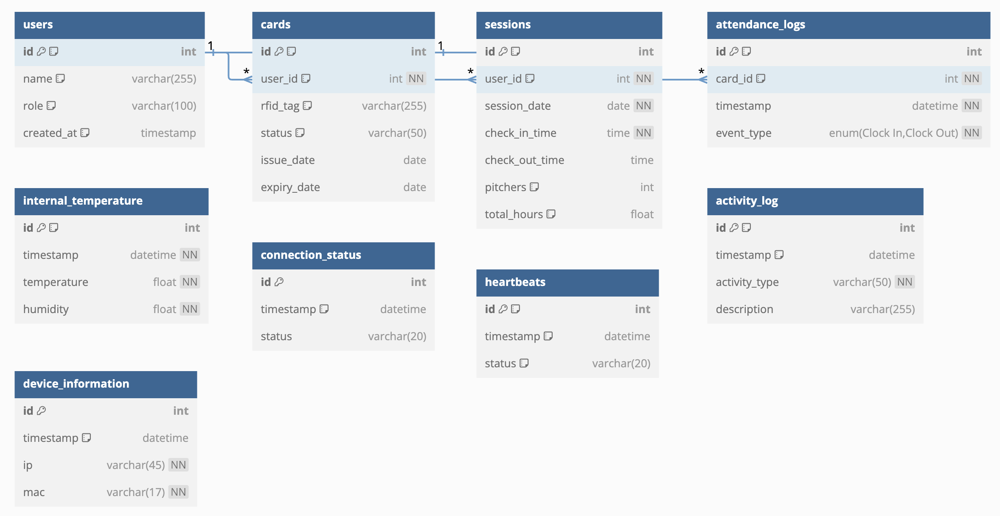
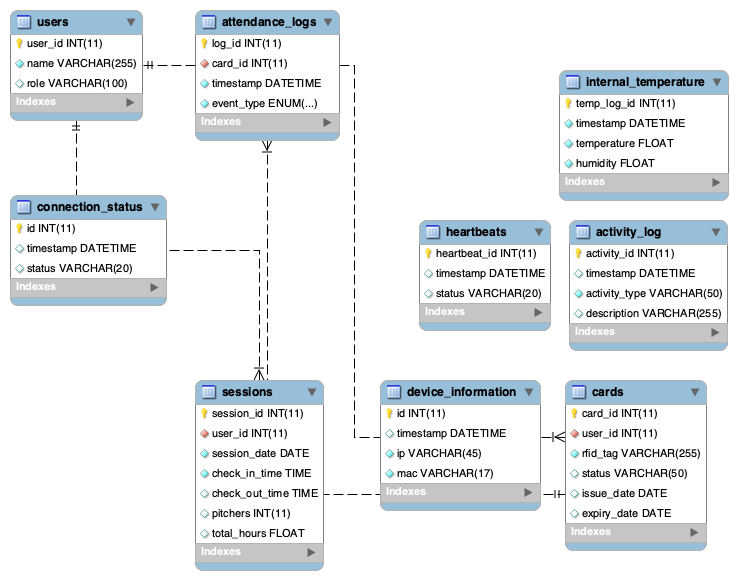

# Database

I have created an ERD using dbdiagram that can create visuals from text input, both text input and visuals are added below.

## ERD


````mermaid
Table users {
  id int [primary key, note: 'User ID']
  name varchar(255) [note: 'User name']
  role varchar(100) [note: 'User role (e.g., Employee, Manager)']
  created_at timestamp [default: `now()`]
}

Table cards {
  id int [primary key, note: 'Card ID']
  user_id int [not null, ref: > users.id, note: 'Associated user ID']
  rfid_tag varchar(255) [unique, note: 'RFID tag']
  status varchar(50) [default: 'Active']
  issue_date date
  expiry_date date
}

Table sessions {
  id int [primary key, note: 'Session ID']
  user_id int [not null, ref: > users.id, note: 'Associated user ID']
  session_date date [not null]
  check_in_time time [not null]
  check_out_time time
  pitchers int [default: 0, note: 'Pitcher count']
  total_hours float [note: 'Calculated total hours']
}

Table attendance_logs {
  id int [primary key, note: 'Log ID']
  card_id int [not null, ref: > cards.id, note: 'Associated card ID']
  timestamp datetime [not null]
  event_type enum('Clock In', 'Clock Out') [not null]
}

Table internal_temperature {
  id int [primary key, note: 'Temperature Log ID']
  timestamp datetime [not null]
  temperature float [not null]
  humidity float [not null]
}

Table connection_status {
  id int [primary key]
  timestamp datetime [default: `CURRENT_TIMESTAMP`]
  status varchar(20)
}

Table heartbeats {
  id int [primary key, note: 'Heartbeat ID']
  timestamp datetime [default: `CURRENT_TIMESTAMP`]
  status varchar(20) [default: 'Active']
}

Table activity_log {
  id int [primary key, note: 'Activity Log ID']
  timestamp datetime [default: `CURRENT_TIMESTAMP`]
  activity_type varchar(50) [not null]
  description varchar(255)
}

Table device_information {
  id int [primary key]
  timestamp datetime [default: `CURRENT_TIMESTAMP`]
  ip varchar(45) [not null]
  mac varchar(17) [not null]
}
````

## EER
Using mysqldatabase I've created an EER with all the proper fields, relations and specifiers



## SQL
From the previously made EER I can generate a mysql querry to create the database.

```` mysql
CREATE DATABASE smart_time_registration;
USE smart_time_registration;

CREATE TABLE users (
    user_id INT AUTO_INCREMENT PRIMARY KEY,
    name VARCHAR(255) NOT NULL,
    role VARCHAR(100)
);

CREATE TABLE cards (
    card_id INT AUTO_INCREMENT PRIMARY KEY,
    user_id INT NOT NULL,
    rfid_tag VARCHAR(255) UNIQUE NOT NULL,
    status VARCHAR(50) DEFAULT 'Active',
    issue_date DATE,
    expiry_date DATE,
    FOREIGN KEY (user_id) REFERENCES users(user_id)
        ON DELETE CASCADE
        ON UPDATE CASCADE
);

CREATE TABLE sessions (
    session_id INT AUTO_INCREMENT PRIMARY KEY,
    user_id INT NOT NULL,
    session_date DATE NOT NULL,
    check_in_time TIME NOT NULL,
    check_out_time TIME,
    pitchers INT DEFAULT 0,
    total_hours FLOAT GENERATED ALWAYS AS (
        TIMESTAMPDIFF(SECOND, CONCAT(session_date, ' ', check_in_time), CONCAT(session_date, ' ', check_out_time)) / 3600
    ) STORED,
    FOREIGN KEY (user_id) REFERENCES users(user_id)
        ON DELETE CASCADE
        ON UPDATE CASCADE
);

CREATE TABLE attendance_logs (
    log_id INT AUTO_INCREMENT PRIMARY KEY,
    card_id INT NOT NULL,
    timestamp DATETIME NOT NULL,
    event_type ENUM('Clock In', 'Clock Out') NOT NULL,
    FOREIGN KEY (card_id) REFERENCES cards(card_id)
        ON DELETE CASCADE
        ON UPDATE CASCADE
);

CREATE TABLE internal_temperature (
    temp_log_id INT AUTO_INCREMENT PRIMARY KEY,
    timestamp DATETIME NOT NULL,
    temperature FLOAT NOT NULL,
    humidity FLOAT NOT NULL
);

CREATE TABLE connection_status (
    id INT AUTO_INCREMENT PRIMARY KEY,
    timestamp DATETIME DEFAULT CURRENT_TIMESTAMP,
    status VARCHAR(20)
);

CREATE TABLE heartbeats (
    heartbeat_id INT AUTO_INCREMENT PRIMARY KEY,
    timestamp DATETIME DEFAULT CURRENT_TIMESTAMP,
    status VARCHAR(20) DEFAULT 'Active'
);

CREATE TABLE activity_log (
    activity_id INT AUTO_INCREMENT PRIMARY KEY,
    timestamp DATETIME DEFAULT CURRENT_TIMESTAMP,
    activity_type VARCHAR(50) NOT NULL,
    description VARCHAR(255)
);

CREATE TABLE device_information (
    id INT AUTO_INCREMENT PRIMARY KEY,
    timestamp DATETIME DEFAULT CURRENT_TIMESTAMP,
    ip VARCHAR(45) NOT NULL,
    mac VARCHAR(17) NOT NULL
);
````

---

### Step-by-Step Guide for Using the SQL Script

1. **Clone the Repository:** Begin by cloning the GitLab project repository to your local machine.
   ```bash
   git clone git@gitlab.fdmci.hva.nl:IoT/2024-2025-semester-1/individual-project/zuuliiyiizoo76.git
   ```
   
2. **Access the SQL Script:** Navigate to the SQL script file in the project directory.
   ```bash
   cd zuuliiyiizoo7/web/php/
   ```

3. **Database Creation:** Open your MySQL client, then run the SQL script to set up the database.
   ```sql
   SOURCE smart_time_registration.sql;
   ```

4. **Verify Database Setup:** Check that all tables are created successfully by listing the tables in the `smart_time_registration` database:
   ```sql
   USE smart_time_registration;
   SHOW TABLES;
   ```

---

### Accessing the SQL Script

You can find the SQL script in the GitLab project repository at the following link:

[SQL Script on GitLab](https://gitlab.fdmci.hva.nl/IoT/2024-2025-semester-1/individual-project/zuuliiyiizoo76/-/blob/main/web/smart_time_registration.sql)
